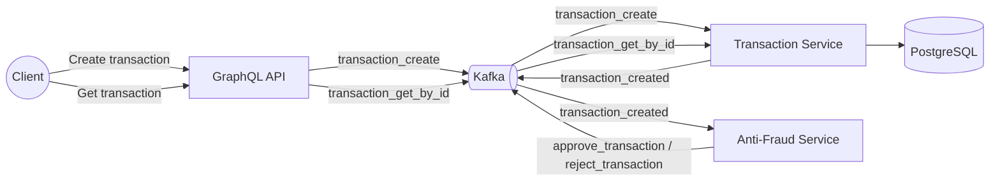
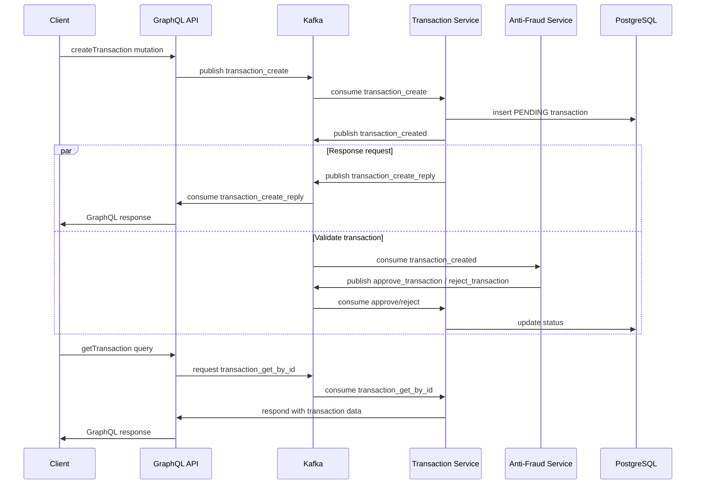

# Yape Code Challenge — Transaction Management with Anti‑Fraud

**Author:** Joshua Navarro

**Stack:** NestJS · Kafka · GraphQL · PostgreSQL · TypeORM · Jest · Docker

> **Hello Yape Team!** 👋 This repository contains my solution to the code challenge. It follows a microservices architecture with event‑driven communication and Clean Architecture principles to keep modules maintainable and testable.

---

## TL;DR (Quick Start)

```bash
# from repository root
docker compose up --build
```

* GraphQL Playground: **[http://localhost:3005/graphql](http://localhost:3005/graphql)**
* Default ports in use: **3005 (GraphQL)**, **5432 (PostgreSQL)**, **9092 (Kafka)**, **6379 (Redis)**.

---

## Overview

This project models the lifecycle of a financial transaction and validates it through an Anti‑Fraud component. The **GraphQL API** is the single entry point. It emits events to Kafka; downstream services process them asynchronously and respond back using a request‑response pattern over Kafka.

### Why this design?

* **Decoupling via Kafka**: resilient async communication and natural back‑pressure handling.
* **Scalability**: each service scales independently.
* **Clean Architecture**: domain logic isolated from frameworks and transports.

---

## Architecture



---

## Services

* **GraphQL API** (`graphql-api/`)

    * Exposes GraphQL API.
    * Produces `transaction_create` and `transaction_get_by_id` events.
    * Waits for service responses over Kafka (request‑response).
    * (Optional) Uses Redis to cache transaction reads.

* **Transaction Service** (`transaction-service/`)

    * Persists transactions (TypeORM + PostgreSQL).
    * On create: saves **PENDING** transaction and publishes `transaction_created`.
    * Consumes `approve_transaction` / `reject_transaction` to update status.
    * Serves `transaction_get_by_id` requests.

* **Anti‑Fraud Service** (`anti-fraud-service/`)

    * Consumes `transaction_created`.
    * Business rule: `value > 1000` ⇒ **REJECTED**; otherwise **APPROVED**.
    * Produces `approve_transaction` or `reject_transaction` accordingly.

> Each service has its own README with details:
>
> * `graphql-api/README.md`
> * `transaction-service/README.md`
> * `anti-fraud-service/README.md`

---

## Tech Stack

* **Node.js** (NestJS)
* **Kafka** (event streaming)
* **GraphQL (Apollo Server)**
* **PostgreSQL + TypeORM**
* **Redis** (for caching in the GraphQL API)
* **Jest** (unit/integration tests)
* **Docker & Docker Compose**

---

## Repository Layout

```
.
├─ graphql-api/
│  ├─ src/
│  ├─ test/
│  └─ README.md
├─ transaction-service/
│  ├─ src/
│  ├─ test/
│  └─ README.md
├─ anti-fraud-service/
│  ├─ src/
│  ├─ test/
│  └─ README.md
├─ docker-compose.yml
└─ README.md  (this file)
```

---

## Running with Docker Compose

### Prerequisites

* Docker Desktop / Engine
* Docker Compose 

### Start everything

```bash
docker compose up --build
```

### Stop & remove containers

```bash
docker compose down
```

> **Note on ports**: Ensure **5432**, **9092**, **3005** and **6379** are free.

---

## Local Development (without Docker)

1. **Requirements**: Node.js ≥ 22 LTS, Yarn
2. Start infra (Kafka, Postgres, optional Redis) using your preferred method.
3. Configure environment variables for each service (see below).
4. In each service folder:

   ```bash
   yarn install
   yarn start:dev
   ```

---

## Environment Variables (per service)

> The compose file provides sensible defaults. For manual runs, configure the following:

### GraphQL API

| Variable                   | Description                |
| -------------------------- |----------------------------|
| `PORT`                     | API port (default: 3005)   |
| `KAFKA_BROKER_0`           | Kafka broker host\:port    |
| `KAFKA_CLIENT_ID_CONSUMER` | Kafka client id (consumer) |
| `KAFKA_CLIENT_ID_PRODUCER` | Kafka client id (producer) |
| `KAFKA_GROUP_ID`           | Kafka consumer group id    |
| `REDIS_HOST` *(optional)*  | Redis host                 |
| `REDIS_PORT` *(optional)*  | Redis port                 |

### Transaction Service

| Variable                                              | Description                  |
| ----------------------------------------------------- | ---------------------------- |
| `PORT`                                                | Service port (default: 3000) |
| `DB_HOST`, `DB_PORT`, `DB_USER`, `DB_PASS`, `DB_NAME` | PostgreSQL connection        |
| `KAFKA_BROKER_0`                                      | Kafka broker host\:port      |
| `KAFKA_CLIENT_ID_CONSUMER`                            | Kafka client id (consumer)   |
| `KAFKA_CLIENT_ID_PRODUCER`                            | Kafka client id (producer)   |
| `KAFKA_GROUP_ID`                                      | Kafka consumer group id      |

### Anti‑Fraud Service

| Variable                   | Description                |
| -------------------------- | -------------------------- |
| `KAFKA_BROKER_0`           | Kafka broker host\:port    |
| `KAFKA_CLIENT_ID_CONSUMER` | Kafka client id (consumer) |
| `KAFKA_CLIENT_ID_PRODUCER` | Kafka client id (producer) |
| `KAFKA_GROUP_ID`           | Kafka consumer group id    |

---

## Using the API (GraphQL)

Open **[http://localhost:3005/graphql](http://localhost:3005/graphql)**.

### Create Transaction

```graphql
mutation createTransaction($createTransactionInput: CreateTransactionInput!) {
  createTransaction(createTransactionData: $createTransactionInput) {
    transactionExternalId
    transactionStatus { id name }
    transactionType { id name }
    value
    createdAt
  }
}
```

**Variables**

```json
{
  "createTransactionInput": {
    "accountExternalIdDebit": "28dbd0c5-4ea0-4d05-8fd9-39e8f76aaf13",
    "accountExternalIdCredit": "d6cd54da-8ce3-4f79-abda-bd5be9b19e68",
    "transferTypeId": 1,
    "value": 1000
  }
}
```

### Get Transaction by ID

```graphql
query getTransaction($transactionId: UUID!) {
  getTransaction(id: $transactionId) {
    transactionExternalId
    transactionStatus { id name }
    transactionType { id name }
    value
    createdAt
  }
}
```

**Variables**

```json
{ "transactionId": "28dbd0c5-4ea0-4d05-8fd9-39e8f76aaf13" }
```

---

## Event Flow (sequence)



---

## Kafka Topics

**Produced**

* `transaction_create` (GraphQL API)
* `transaction_created` (Transaction Service)
* `approve_transaction` / `reject_transaction` (Anti‑Fraud)

**Consumed**

* `transaction_created` (Anti‑Fraud)
* `approve_transaction` / `reject_transaction` (Transaction Service)
* `transaction_get_by_id` (Transaction Service)

---

## Testing

From each service folder:

```bash
yarn test
# or with coverage
yarn test:cov
```

---

## Scalability Notes (Optional Challenge)

* **Kafka** decouples producers/consumers and smooths spikes.
* **DB Indexing** on transaction identifiers and timestamps for read performance.
* **Horizontal scaling** per service (stateless containers).
* **Future**: add CQRS with read‑optimized models/replicas; outbox pattern for exactly‑once‑like delivery; idempotent consumers.

---

## Troubleshooting

* **Ports already in use**: stop conflicting services or remap ports in `docker-compose.yml`.
* **Kafka not reachable**: confirm broker address in `KAFKA_BROKER_0` and container networking.
* **Database errors**: ensure Postgres is healthy and env vars match the compose config.
* **GraphQL API not loading**: check `/health/liveness` and `/health/readiness` to ensure services are up.

---

## License & Attribution

This submission is provided for the Yape code challenge.
© Joshua Navarro — 2025
